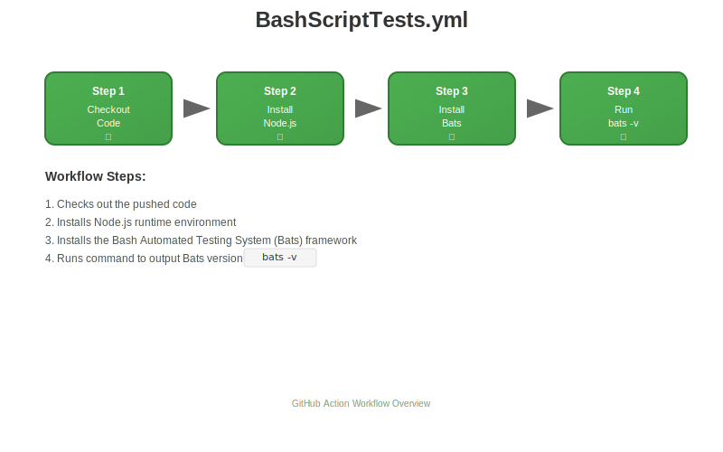

# myGitActions

## **🛠 GitHub Actions Workflow:** BashScriptTests.yml  

This repository includes a GitHub Actions workflow defined in **.github/workflows/BashScriptTests.yml.** Note: This workflow runs on every push to test with Bats.  

Workflow Name: learn-github-actions
Trigger: On every push
Purpose: Installs the Bash Automated Testing System (Bats) and displays its version.  

🔄 Workflow Steps
- **Checkout Code** – Retrieves the repository content using actions/checkout@v4.
- **Set Up Node.js** – Installs Node.js version 20 using actions/setup-node@v4.
- **Install Bats** – Installs the Bats testing framework globally using npm.
- **Verify Bats Installation** – Runs bats -v to confirm the version.

The workflow diagram:

