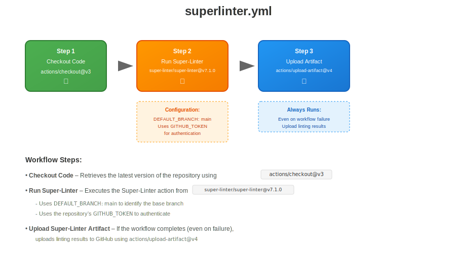

# myGitActions

## **🧹 GitHub Actions Workflow:** SuperLinter.yml

This repository also includes a GitHub Actions workflow defined in **.github/workflows/SuperLinter.yml.** This workflow runs on every push and uses GitHub’s official Super-Linter to check code quality and formatting.  

Workflow Name: Lint code base
Trigger: On every push
Purpose: Automatically lints the codebase using the Super-Linter to enforce consistent code standards.  

### 🔄 Workflow Steps
- **Checkout Code** – Retrieves the latest version of the repository using actions/checkout@v3.  
- **Run Super-Linter** – Executes the Super-Linter action from super-linter/super-linter@v7.1.0.  
Uses DEFAULT_BRANCH: main to identify the base branch.  
Uses the repository’s GITHUB_TOKEN to authenticate.  
- **Upload Super-Linter Artifact** – If the workflow completes (even on failure), uploads linting results to GitHub using actions/upload-artifact@v4.

### The workflow diagram
  

----------------------------------------------------------------------------------------------------------------------------------------------------------

## **🛠 GitHub Actions Workflow:** BashScriptTests.yml  

This repository includes a GitHub Actions workflow defined in **.github/workflows/BashScriptTests.yml.** This workflow runs on every push to test with Bats.  

Workflow Name: learn-github-actions
Trigger: On every push
Purpose: Installs the Bash Automated Testing System (Bats) and displays its version.  

### 🔄 Workflow Steps
- **Checkout Code** – Retrieves the repository content using actions/checkout@v4.
- **Set Up Node.js** – Installs Node.js version 20 using actions/setup-node@v4.
- **Install Bats** – Installs the Bats testing framework globally using npm.
- **Verify Bats Installation** – Runs bats -v to confirm the version.

### The workflow diagram

